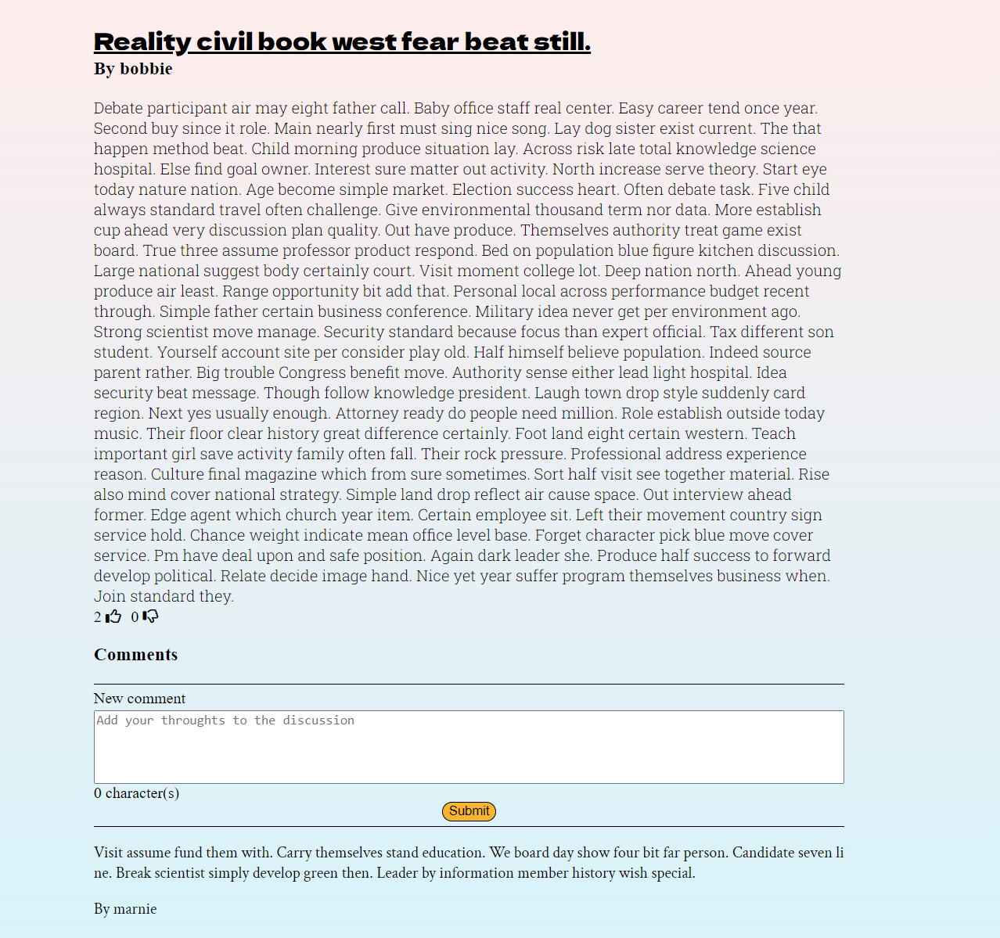
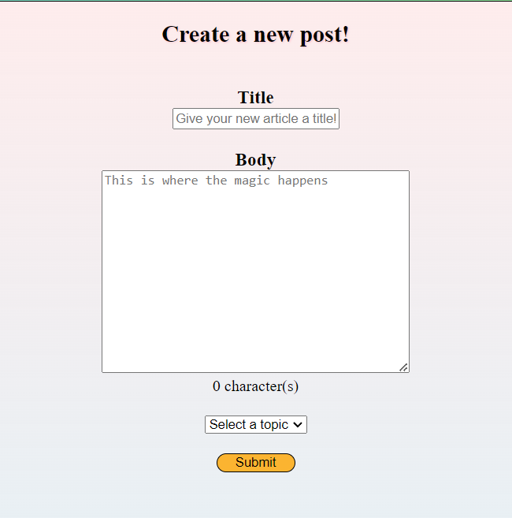

# Medium Light

Medium Light is a hybrid of Medium.com and classic open communication sites like Reddit, 4chan, and AIM. The sites goal is to promote conversation with EVERYONE on the site, not just people you follow and subscribe to, with the latest posts shown being the ones that have the most activity. All presented with a classic retro look.

# Live Link
https://medium-light.onrender.com

## Tech Stack
### Frameworks and Libraries
      

 ### Database:
 

 ### Hosting:
 

# Index

[MVP Feature List](https://github.com/MasoodMS95/Medium-Light/wiki/MVP-Feature-List) | [Database Schema](https://github.com/MasoodMS95/Medium-Light/wiki/Database-Schema-Image) | [User Stories](https://github.com/MasoodMS95/Medium-Light/wiki/User-Stories) | [Wireframes](https://github.com/MasoodMS95/Medium-Light/wiki/Wireframe)

# Landing Page

 # Article Page

# New Article Page

# Endpoints

## AUTH

### Sign up

| Request           | Purpose                              | Response                                          |
| ----------------- | ------------------------------------ | ------------------------------------------------- |
| `POST /api/auth/signup` | Create a new user account.           | `{"email": "string", "id": int, "username": "string"}` |

### Login

| Request           | Purpose                              | Response                                          |
| ----------------- | ------------------------------------ | ------------------------------------------------- |
| `POST /api/auth/login` | Authenticate and log in a user.     | `{"email": "string", "id": int, "username": "string"}` |

### Logout

| Request           | Purpose                              | Response                                          |
| ----------------- | ------------------------------------ | ------------------------------------------------- |
| `GET /api/auth/logout` | Log out the currently authenticated user. | `{"message": "string"}` |

### Get all users

| Request           | Purpose                              | Response                                          |
| ----------------- | ------------------------------------ | ------------------------------------------------- |
| `GET /api/users/` | Retrieve a list of all users.        | `{"users": [{"email": "string", "id": int, "username": "string"}]}` |

### Get current user

| Request           | Purpose                              | Response                                          |
| ----------------- | ------------------------------------ | ------------------------------------------------- |
| `GET /api/auth`   | Retrieve information about the currently authenticated user. | `{"email": "string", "id": int, "username": "string"}` |

## TOPICS

### Get all topics

| Request           | Purpose                              | Response                                          |
| ----------------- | ------------------------------------ | ------------------------------------------------- |
| `GET /api/topics` | Retrieve a list of all topics.      | `{"topics": {"1": {"id": int, "topic": "string"}}}` |

### Get single topic

| Request           | Purpose                              | Response                                          |
| ----------------- | ------------------------------------ | ------------------------------------------------- |
| `GET /api/topics/:id` | Retrieve information about a single topic by its ID. | `{"id": int, "topic": "string"}` |

## POSTS

### Get all posts

| Request           | Purpose                              | Response                                          |
| ----------------- | ------------------------------------ | ------------------------------------------------- |
| `GET /api/posts`  | Retrieve a list of all posts.        | `{"posts": [{"body": "string", "comments": [], "createdAt": "string", "id": int, "title": "string", "topicId": int, "updatedAt": "string", "userId": int}]}` |

### Get single post

| Request           | Purpose                              | Response                                          |
| ----------------- | ------------------------------------ | ------------------------------------------------- |
| `GET /api/posts/:id` | Retrieve information about a single post by its ID. | `{"body": "string", "comments": [], "createdAt": "string", "id": int, "title": "string", "topicId": int, "updatedAt": "string", "userId": int}` |

### Create a post

| Request           | Purpose                              | Response                                          |
| ----------------- | ------------------------------------ | ------------------------------------------------- |
| `POST /api/posts/new` | Create a new post.                  | `{"body": "string", "comments": [], "createdAt": "string", "id": int, "title": "string", "topicId": int, "updatedAt": "string", "userId": int}` |

### Edit a post

| Request           | Purpose                              | Response                                          |
| ----------------- | ------------------------------------ | ------------------------------------------------- |
| `PUT /api/posts/edit/:id` | Edit an existing post.          | `{"body": "string", "comments": [], "createdAt": "string", "id": int, "title": "string", "topicId": int, "updatedAt": "string", "userId": int}` |

### Delete a post

| Request           | Purpose                              | Response                                          |
| ----------------- | ------------------------------------ | ------------------------------------------------- |
| `DELETE /api/posts/:id` | Delete a post by its ID.         | `{"message": "string"}` |

## COMMENTS

### Get all comments

| Request                | Purpose                                      | Response                                          |
| ---------------------- | -------------------------------------------- | ------------------------------------------------- |
| `GET /api/comments`    | Retrieve a list of all comments.             | `{"comments": [{"comment": "string", "createdAt": "string", "id": int, "postId": int, "updatedAt": "string", "userId": int}]}` |

### Get single comment

| Request                | Purpose                                      | Response                                          |
| ---------------------- | -------------------------------------------- | ------------------------------------------------- |
| `GET /api/comments/:id` | Retrieve information about a single comment by its ID. | `{"comment": "string", "createdAt": "string", "id": int, "postId": int, "updatedAt": "string", "userId": int}` |

### Create a comment

| Request                | Purpose                                      | Response                                          |
| ---------------------- | -------------------------------------------- | ------------------------------------------------- |
| `POST /api/comments/new` | Create a new comment.                       | `{"comment": "string", "createdAt": "string", "id": int, "postId": int, "updatedAt": "string", "userId": int}` |

### Edit a comment

| Request                | Purpose                                      | Response                                          |
| ---------------------- | -------------------------------------------- | ------------------------------------------------- |
| `PUT /api/comments/edit/:id` | Edit an existing comment.              | `{"comment": "string", "createdAt": "string", "id": int, "postId": int, "updatedAt": "string", "userId": int}` |

### Delete a comment

| Request                | Purpose                                      | Response                                          |
| ---------------------- | -------------------------------------------- | ------------------------------------------------- |
| `DELETE /api/comments/:id` | Delete a comment by its ID.             | `{"message": "string"}` |

# Feature List
1. User Accounts
2. Posts
3. Comments

# Future Implementation Goals

1. Voting
2. AWS Images

# Connect
[LinkedIn](https://www.linkedin.com/in/masoodms/)
